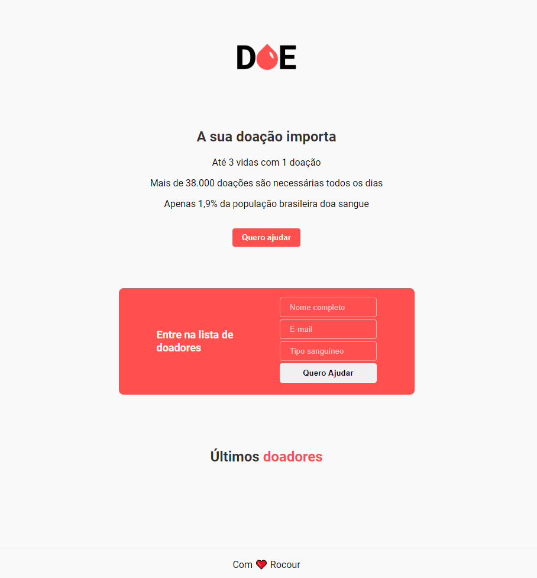
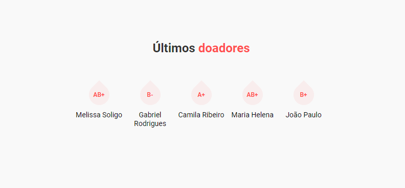

# doesangue

Doe sangue é um projeto desenvolvido na MaratonaDev 3.0 Rocketseat. 
Com a proposta de desenvolver uma aplicação web totalmente do zero utilizando técnologias em alta no mercado em apenas dois dias. 

### Arquitetura
Devido a aplicação ser extremamente simples, uma aplicação de apaneas uma página, sua arquitetura é muito simples, com o **Frontend** sendo construído usando basicamente `HTML` e `CSS` e o **Backend** construído em `Nodejs` com a integração do bando de dados `Postgres`.

### Inicio
Para iniciar com a aplicação, bastar iniciar o projeto em node para as dependências serem instaladas corretamente com o código:

~~~npm
npm install
~~~
Desta forma é garantido que as depedências como: `express`, `postgres` e `nunjucks` sejam instaladas e atribuídas ao projeto, garantindo seu funcionamento.

### Aplicação 

A aplicação funciona de forma muito simples, clicando no botão **Quero ajudar** o formulário se abre e assim quando uma pessoa se cadastra, essa informação é enviada e armazenada no bando de dados e depois recuperada e exibida na seção de últimos doadores 😊. 

